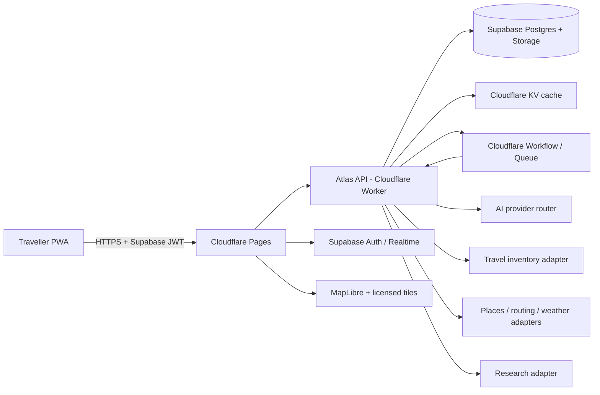
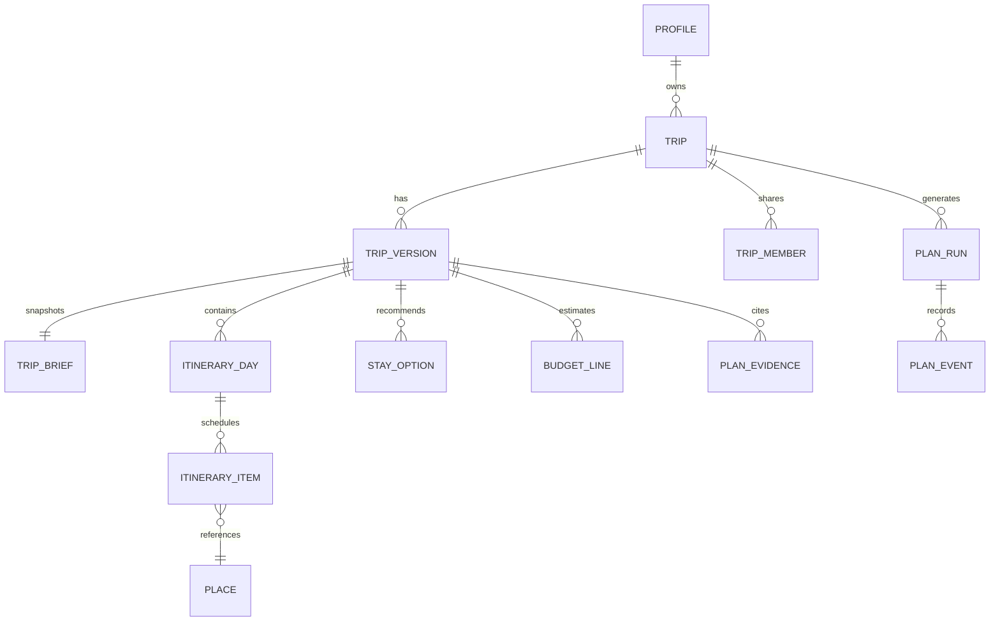
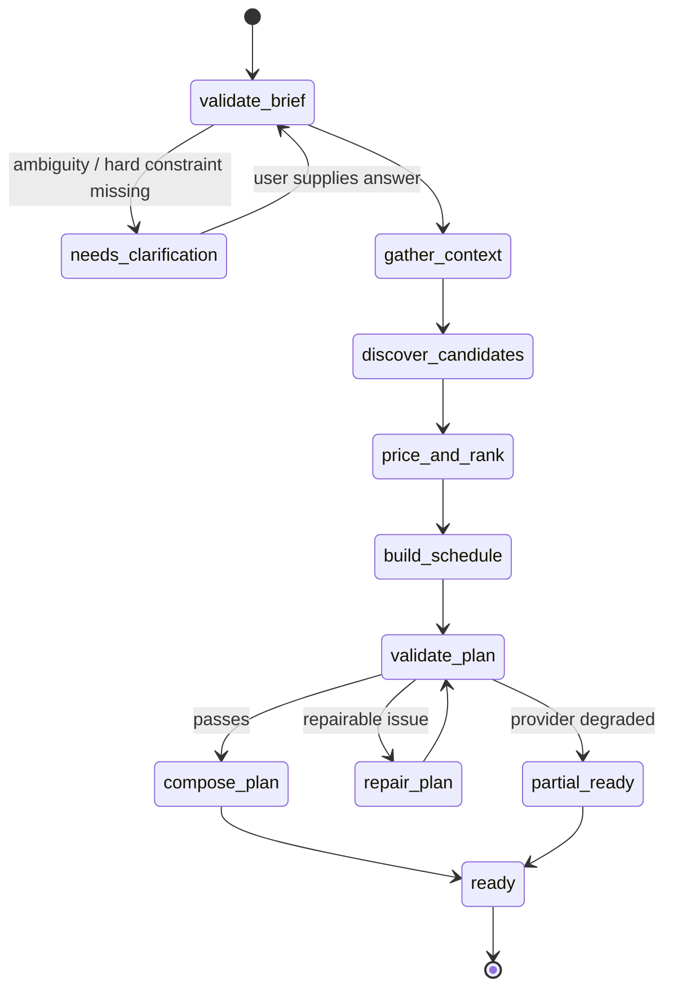

# Project Atlas - Technical Specification

**System:** AI-powered travel planning progressive web application
**Status:** Build-ready architecture proposal
**Version:** 1.0
**Prepared:** 20 July 2026
**Companion:** [Product Requirements Document](./project-atlas-prd.md)

## 1. Architecture decision

Project Atlas will use an **edge-native TypeScript architecture**:

- **Web client:** React, TypeScript, Vite, Tailwind CSS, Radix/shadcn primitives, Framer Motion, TanStack Query, and `vite-plugin-pwa`.
- **Hosting:** Cloudflare Pages for the production PWA; Vercel only for personal/non-commercial preview deployments because Hobby is restricted to that use. [[1]](https://vercel.com/docs/plans/hobby)
- **API/orchestration:** Hono on a Cloudflare Worker; Cloudflare Workflows/Queues only for durable asynchronous plan builds and refreshes.
- **System of record:** Supabase Postgres, Auth, Storage, Realtime, and optional `pgvector` retrieval. Supabase’s free plan is sufficient for the pilot but pauses inactive projects after one week and has no automatic backups, so exports and an operational wake-up check are mandatory. [[2]](https://supabase.com/pricing)
- **Cache/rate limit:** Cloudflare KV for public/provider response cache, idempotency records, and coarse rate-limit windows; never the source of truth.
- **AI layer:** a provider-neutral OpenAI-compatible interface. Gemini is primary, Groq is fallback, and OpenRouter is a final compatibility fallback. The selected model is server-controlled and quota-aware.
- **Maps/data:** MapLibre GL JS on the client; provider adapters for places/geocoding/routing, weather, research, and approved travel inventory.

This deliberately does **not** start with a separately hosted LangGraph Python service. It eliminates a paid/always-on server from the MVP, avoids cross-runtime operational work, and keeps the full plan state in one versioned database. The workflow is still agentic: typed specialist nodes share a durable state, invoke tools, and can pause, retry, or request user input. If the product later needs long-running, human-in-the-loop specialist agents, migrate the orchestration package to LangGraph.js or a separately operated LangGraph service without changing the web/API contracts. LangGraph is designed for durable execution, streaming, human-in-the-loop flows, and persistence, but it is a framework—not a reason to add infrastructure before it is needed. [[3]](https://langchain-ai.github.io/langgraph/reference/)

**AWS position:** keep AWS out of the critical path for the first deployment. New AWS Free plans are credit/time bounded (up to $200 and six months), while legacy accounts have different rules; it is a useful experiment/backup environment, not an enduring “free production” assumption. Create a $0 budget alert before enabling any AWS service. Revisit AWS for S3 archival, EventBridge, or a containerised specialist service only once there is a funded scale requirement. [[4]](https://docs.aws.amazon.com/awsaccountbilling/latest/aboutv2/free-tier.html)

## 2. Deployment topology



### 2.1 Ownership boundaries

| Component | Owner / authority | Allowed data |
|---|---|---|
| Browser | Untrusted user agent | Session access token, public plan representation, temporary local cache; no provider secrets. |
| Atlas Worker | Policy enforcement point | Validated input, user identity, service-role database access, provider secrets, quota state. |
| Supabase | Authoritative persistence | Profiles, trip versions, user preferences, facts, cache metadata, collaboration ACLs, audit events. |
| KV | Ephemeral performance layer | Provider payloads allowed by licence, route matrices, short-lived request dedupe, quota counters. |
| External providers | Source-specific authority | Fetch only through adapters; preserve source timestamp, licence/attribution, raw reference ID, and refresh policy. |

### 2.2 Why this fits the zero-cost pilot

- Cloudflare Workers Free includes 100,000 requests/day but only 10 ms CPU per invocation; remote fetch wait time is not used for arbitrary compute. Keep Worker nodes I/O-heavy and move no CPU-heavy optimisation into the edge request path. [[5]](https://developers.cloudflare.com/workers/platform/pricing/)
- KV Free includes 100,000 reads/day and 1,000 writes/day; apply long, intentional TTLs and cache a complete keyed payload rather than writing a key per place/card. [[6]](https://developers.cloudflare.com/kv/platform/pricing/)
- Cloudflare Workflows Free includes 3,000 steps/day, and Queues Free includes 10,000 operations/day. Use workflows only for genuine multi-step plan jobs, not every screen interaction. [[7]](https://developers.cloudflare.com/changelog/product-group/developer-platform/) [[8]](https://developers.cloudflare.com/queues/platform/pricing/)
- Supabase Free has 500 MB Postgres, 1 GB storage, 50,000 MAU, 5 GB egress, 500,000 edge-function invocations, and is therefore ample for a controlled pilot—not a substitute for production backup/availability planning. [[2]](https://supabase.com/pricing)
- Cloudflare Pages Free permits 500 builds/month and 20,000 files/site. [[9]](https://developers.cloudflare.com/pages/platform/limits/)

## 3. Repository and module layout

```text
atlas/
  apps/
    web/                         # Vite React PWA
      src/features/{brief,trip,map,budget,chat}/
      src/lib/{api,auth,offline,analytics}/
      public/
    api/                         # Cloudflare Worker + Hono
      src/routes/
      src/middleware/
      src/services/
      src/providers/
      src/workflows/
  packages/
    contracts/                   # Zod schemas + OpenAPI types, no runtime secrets
    planner-core/                # deterministic ranking, budget, schedule validation
    agent-graph/                 # typed nodes, state machine, prompt catalog
    ui/                          # reusable, accessible presentational components
    config/                      # eslint, tsconfig, Tailwind tokens
  supabase/
    migrations/
    seed/
    tests/rls/
  infra/
    wrangler.toml
    cloudflare-pages.toml
    github-actions/
  docs/
```

Use a `pnpm` workspace with strict TypeScript, generated database types, and a package boundary rule: browser code imports only public contracts and client-safe utilities; provider SDKs and prompts never enter the web build.

## 4. Domain model

### 4.1 Core entities



| Entity | Purpose | Important fields |
|---|---|---|
| `profiles` | User-level defaults | `id`, locale, currency, unit system, consent settings. |
| `trips` | Stable trip identity and sharing root | `id`, `owner_id`, title, `current_version_id`, status, timestamps. |
| `trip_members` | Access control | `trip_id`, `user_id`, role (`owner`, `editor`, `viewer`). |
| `trip_versions` | Immutable, user-visible plan snapshot | `id`, `trip_id`, parent version, revision reason, state, summary JSONB, generation metadata. |
| `trip_briefs` | Structured request snapshot | destination, dates/duration, travellers, preferences, constraints, budget, source flags. |
| `places` | Canonicalised POI/stay/area | provider IDs, coordinates, timezone, category, canonical name, fact payload, freshness. |
| `itinerary_days/items` | Feasible agenda | date, order, start/end, item kind, `place_id`, travel mode/duration/cost, lock state. |
| `stay_options` | Proposed or selected accommodation | provider reference, area, occupancy/date query fingerprint, price basis, score breakdown, booking link. |
| `budget_lines` | Auditable totals | category, low/likely/high, currency, calculation method, confidence, evidence ID. |
| `plan_evidence` | Provenance registry | source/provider, URL/reference, fetched time, expiry, licence/attribution, fact IDs. |
| `plan_runs/events` | Workflow and audit trail | idempotency key, stage, status, provider metrics, sanitised error, trace ID. |
| `feedback` | User corrections and quality signal | entity ref, feedback type, optional note, explicit consent flag. |

### 4.2 Versioning invariant

`trip_versions` is append-only after reaching `ready`. Every applied replan creates a child version. `trips.current_version_id` changes in a transaction only after validations pass. A user can restore any prior version by creating a new child; do not mutate historical versions. This supports undo, sharing, prompt debugging, and user trust.

### 4.3 Evidence invariant

Any field presented as current/externally sourced must resolve to a `plan_evidence` record. The record stores:

```ts
type Evidence = {
  id: string;
  source: 'booking' | 'amadeus' | 'geoapify' | 'weather' | 'tavily' | 'editorial' | 'user';
  referenceUrl?: string;
  sourceRecordId?: string;
  fetchedAt: string;
  expiresAt?: string;
  licence?: string;
  attribution?: string;
  freshness: 'live' | 'recent' | 'seasonal' | 'static' | 'user_entered';
};
```

The UI derives its `Live`, `Quoted`, `Estimated`, and `Needs verification` badges from evidence; it never trusts a text label emitted by an LLM.

## 5. API contract

All endpoints live under `/v1`. The Worker validates every request and response using Zod schemas from `@atlas/contracts`. Browser calls carry a Supabase access token in `Authorization: Bearer`; the Worker verifies it against Supabase/JWKS, derives identity, and never accepts a user ID from JSON.

| Method / route | Purpose | Response / behaviour |
|---|---|---|
| `POST /v1/trips` | Validate and create a trip brief | `201` trip with `draft` version. Idempotency-Key supported. |
| `POST /v1/trips/:id/generate` | Start plan generation | `202` with `runId`, version ID, SSE URL; rejects concurrent generation for same trip. |
| `GET /v1/runs/:runId/events` | Stream progress | SSE events: stage, partial section, warning, complete, failed. |
| `GET /v1/trips/:id` | Read trip/current version | Owner/editor/viewer filtering; cache-control private. |
| `GET /v1/trips/:id/versions/:versionId` | Read immutable version | Includes evidence references and presentation DTO. |
| `POST /v1/trips/:id/replan` | Interpret or apply change | `mode: preview|apply`; preview returns typed patch and diff; apply creates child version. |
| `PATCH /v1/trips/:id/items/:itemId` | Direct itinerary edit | Validates ownership/lock and schedules lightweight revalidation. |
| `POST /v1/trips/:id/share` | Grant/revoke member access | Owner only; emits audit event. |
| `POST /v1/feedback` | Record user correction | Rate-limited; no model training use without consent. |
| `GET /v1/health` | Dependency health (internal/public minimal) | No secrets or provider payloads. |

### 5.1 Error envelope

```json
{
  "error": {
    "code": "PROVIDER_UNAVAILABLE",
    "message": "Hotel availability is temporarily unavailable. Your itinerary is still ready.",
    "retryable": true,
    "traceId": "req_..."
  }
}
```

Use stable codes (`INVALID_BRIEF`, `NOT_FOUND`, `FORBIDDEN`, `RATE_LIMITED`, `CONFLICT`, `PROVIDER_UNAVAILABLE`, `QUOTA_EXHAUSTED`, `VALIDATION_FAILED`). Do not expose vendor exception messages, prompt fragments, or credentials.

## 6. Agentic plan workflow

### 6.1 State machine



### 6.2 Node contract

Every node receives a JSON-serialisable `PlanState`, may add facts/evidence/warnings, and returns a typed transition. It cannot access the database or a provider directly; dependencies are injected via a tool registry with allowlisted methods. A node must be idempotent under the run’s `idempotencyKey`.

| Node | Deterministic responsibility | LLM responsibility | Failure handling |
|---|---|---|---|
| `validateBrief` | Schema, dates, budget/currency, feasible duration, resolved destination | Convert free text to a strict preference patch | Ask one focused question or halt. |
| `gatherContext` | Location, timezone, forecast eligibility, season window | Summarise grounded contextual facts | Degrade to seasonal/no-forecast state. |
| `discoverCandidates` | Provider retrieval, canonicalisation, dedupe, evidence capture | Pick query facets and classify interests | Use cached/editorial fallback; mark missing sources. |
| `priceAndRank` | Exact price handling, scoring inputs, sort/filter, constraints | Explain score trade-offs in plain language | Omit price claim; show range/redirect only. |
| `buildSchedule` | Cluster, route matrix, time windows, schedule solver, budget roll-up | Suggest theme/story only from selected facts | Relax soft constraints; never hard constraints. |
| `validatePlan` | Schema, overlaps, travel coverage, budget reconciliation, stale data, duplicates | None | Repair once/twice; otherwise partial ready. |
| `composePlan` | Persist immutable DTO and evidence refs | Concise narrative and “why this works” | Use deterministic templates if model fails. |

### 6.3 Plan state

```ts
type PlanState = {
  run: { id: string; tripId: string; targetVersionId: string; mode: 'generate' | 'replan' };
  brief: TripBrief;
  constraints: ResolvedConstraints;
  facts: Record<string, GroundedFact>;
  candidates: CandidateSet;
  routeMatrix: RouteMatrix;
  proposedPlan?: ProposedPlan;
  evidence: Evidence[];
  warnings: PlannerWarning[];
  providerStatus: ProviderStatus[];
  attempts: Record<string, number>;
};
```

Snapshots are persisted after every workflow node. A run can resume from its latest successful node. Do not persist raw LLM chain-of-thought; retain only structured output, prompt version/hash, tool IDs, model ID, token/cost metadata, and user-visible reasoning.

### 6.4 Deterministic schedule algorithm

The initial scheduler need not solve the travelling-salesperson problem globally. It must be predictable, fast, and repairable:

1. Filter candidates by hard constraints (date, closure, age/diet/access when verified, price ceiling, user excludes).
2. Score candidates using preference fit, source confidence, cost fit, geographic novelty, and popularity/quality signals.
3. Cluster candidates around hotel/area and day themes using coordinates and interest diversity.
4. Build a route-time matrix only for the selected top candidates (cap at 20/day).
5. Greedily seed each day near the stay/previous endpoint, then insert candidates where travel + visit duration fits.
6. Run 2-opt/local swaps and adjacent-day swaps to reduce travel time without breaking time windows.
7. Insert meal/rest/transit buffers and enforce a pace-specific walking/active-time ceiling.
8. Recalculate every budget line and validate. If invalid, drop the lowest-value flexible item or request a trade-off.

Hard constraints: locked items, date, explicit budget cap (unless user accepts overage), known opening hours, and no overlap. Soft constraints: interest coverage, route efficiency, variety, crowds, day theme, and “hidden gem” mix.

## 7. Provider adapter design

```ts
interface HotelProvider {
  search(input: HotelSearchInput, context: ProviderContext): Promise<HotelSearchResult>;
  availability?(input: HotelAvailabilityInput, context: ProviderContext): Promise<HotelAvailabilityResult>;
}

interface GeoProvider {
  geocode(query: string): Promise<LocationCandidate[]>;
  searchPlaces(input: PlaceSearchInput): Promise<PlaceResult[]>;
  routeMatrix(input: RouteMatrixInput): Promise<RouteMatrix>;
}

interface WeatherProvider {
  forecast(input: WeatherInput): Promise<WeatherForecast>;
  seasonal(input: SeasonalInput): Promise<SeasonalSummary>;
}

interface ResearchProvider {
  search(input: GroundedSearchInput): Promise<ResearchDocument[]>;
}

interface LlmProvider {
  generateStructured<T>(input: StructuredPrompt<T>): Promise<T>;
}
```

### 7.1 Provider rules

- Adapters normalise source records into contracts but retain the raw source ID, timestamp, price semantics, and provider-required attribution.
- Every provider call has a timeout, request budget, trace ID, typed error mapping, and circuit breaker state.
- Cache only if licence and data class allow it. Exact supplier prices are keyed by all availability determinants and expire aggressively.
- Inventory responses are never passed wholesale to an LLM. Extract a small validated candidate subset first.
- Web-search text is treated as untrusted data: delimit it, strip instructions, do not let it select tools, and only extract facts that can carry a source URL.

### 7.2 Provider selection at launch

| Function | Development/pilot choice | Production gate |
|---|---|---|
| Hotels | Booking.com Demand API sandbox; listing/redirect fallback | Approved Affiliate Partner credentials and completed display/compliance review. Booking supports content-only and search-look-redirect flows. [[10]](https://developers.booking.com/demand/docs/getting-started/overview) |
| Flights | Optional Amadeus research adapter | Feature remains disabled unless inventory/data quality is adequate for market. Amadeus production has live data but API-specific quota/billing. [[11]](https://developers.amadeus.com/self-service/apis-docs/guides/developer-guides/pricing/) |
| Places/routes | Geoapify adapter, cache heavily | Confirm commercial licence; free plan permits limited commercial use and 3,000 credits/day. [[12]](https://www.geoapify.com/pricing/) |
| Weather | Open-Meteo only for prototype/non-commercial test | Replace/configure commercial key before commercial launch. [[13]](https://open-meteo.com/en/docs) |
| Research | Tavily low-volume discovery of authoritative pages | 1,000 free API credits/month; enforce a query budget and cache document facts. [[14]](https://help.tavily.com/articles/8816424538-pricing) |
| AI | Gemini primary; Groq and OpenRouter fallbacks | Use account-specific rate limits, health checks, request caps, and model feature flags. [[15]](https://ai.google.dev/gemini-api/docs/rate-limits) [[16]](https://console.groq.com/docs/rate-limits) [[17]](https://openrouter.ai/docs/faq) |

## 8. Caching, quotas, and cost controls

### 8.1 Cache taxonomy

| Cache class | Example | Storage | Suggested TTL | Key rule |
|---|---|---|---|---|
| Static destination facts | country etiquette, airport transfer overview | Postgres/editorial + CDN | 30-90 d | locale + destination + content version |
| Semi-static POI | coordinate/category/photo metadata | KV/Postgres | 7-30 d | provider + canonical ID |
| Weather | date/location forecast | KV | 1-6 h | rounded lat/lng + date + provider |
| Exact hotel availability | stay for dates/guests/currency | KV, only if provider permits | 5-15 min | provider + property + check-in/out + occupancy + currency + locale |
| Route matrix | selected day candidates | KV | 24 h | provider + mode + rounded coordinate set |
| Research extract | cited destination fact | Postgres | 7 d with review date | normalised query + domain/source ID |
| Idempotency | create/generate request | KV + DB record | 24 h | user ID + method + client key |

### 8.2 Cost circuit breakers

1. Define per-user/day limits: full generations, replans, hotel searches, research queries, and LLM output tokens.
2. Define global provider budgets in KV with atomic-safe coarse enforcement; fail closed for paid-capable providers and degrade for free providers.
3. Deduplicate identical in-flight queries by cache key.
4. Serve a recent cached result only with a visible “last checked” marker; never relabel it live.
5. Configure Cloudflare/Supabase usage alerts and a daily health/usage job. Free limits reset on their provider-defined schedule; assume capacity can be exhausted.

## 9. Security model

### 9.1 Authentication and authorisation

- Supabase Auth supports email magic link and OAuth for MVP. The Worker validates JWTs and claims; browser direct database access uses anon key plus RLS only.
- Enable RLS on **every** user-related table. Policies derive access from `auth.uid()` joined through `trip_members`; no client-supplied owner IDs.
- Service-role credentials exist only in Worker secrets and in migration/CI environments. They cannot appear in Pages environment variables prefixed for the client.
- Generate signed, short-expiry URLs for private exports/media. Do not make trip exports public by default.

### 9.2 Threat controls

| Threat | Control |
|---|---|
| Prompt injection in searched content | Treat retrieved text as data; tool selection/code paths are fixed; validate extracted facts; omit instructions from context. |
| Secret leakage | Worker secrets only, GitHub secret scanning, no client provider calls that require keys, redact logs. |
| IDOR / trip disclosure | RLS integration tests, server-side membership check, opaque UUIDs, security audit events. |
| Rate/cost abuse | User/IP rate limits, CAPTCHA/Turnstile on anonymous entry points, quota counters, idempotency keys. |
| XSS | React escaping, strict CSP, sanitised markdown renderer, no HTML from providers. |
| SSRF | Fixed provider base URLs, URL allowlist for research fetch, no arbitrary server fetch endpoint. |
| Stale/misleading travel data | Evidence expiry, UI freshness label, forced refresh before live/booking claim, source-specific tests. |

### 9.3 Privacy

- Data classification: account identifiers (confidential), trip preferences (confidential), shared trip content (confidential), provider data (licensed), public destination facts (internal/public by licence).
- Provide export/delete flows. Delete cascades user-owned trip data after a short recovery window; preserve only legally necessary, anonymised security logs.
- Do not use trip content to train a model unless the user has given explicit, separate consent.

## 10. PWA and client implementation

### 10.1 Offline contract

The PWA is offline-capable, not offline-generative. Workbox caches:

- app shell and versioned static assets: precache;
- map UI assets: cache-first with size/age limits;
- the most recently opened *sanitised* trip DTO: IndexedDB, encrypted only where the platform permits, otherwise minimal and clearly device-local;
- read-only destination guide content: stale-while-revalidate.

Network-only: authenticated mutations, new plan generation, booking links, live prices, weather refresh, and any provider query. The interface shows an explicit offline banner and the date of locally cached plan data.

### 10.2 State and rendering

- TanStack Query handles remote data, invalidation by `tripId/versionId`, and optimistic UI only for locally reversible item moves.
- A local Zustand store handles transient interface state (selected day, map viewport, sheet/dialog state); it is not a shadow database.
- Realtime subscription is scoped to the current authenticated user’s trip/version. On a new ready version, display a change banner rather than unexpectedly replacing the visible itinerary.
- Map rendering is lazy-loaded; static list equivalents remain available to assistive technologies.

### 10.3 Design tokens

- Token-based colour, type, spacing, elevation, radius, motion, and focus-ring primitives are kept in `packages/ui`.
- Support `prefers-color-scheme` only after contrast tests; default to light editorial palette for launch.
- All contrast, status, and budget change indicators pair text/icon with colour.

## 11. Observability and quality

### 11.1 Telemetry

Use structured logs with `traceId`, `tripId` (hash/minimised where possible), run ID, node, provider, latency, cache result, token count, and error code. Never log prompt bodies, access tokens, email addresses, or exact user plans in third-party observability by default.

Metrics:

- Worker request/error/latency; provider latency/error/quota; cache hit ratio.
- Workflow stage duration, resume count, partial-plan rate, validation-failure reasons.
- Model provider/model ID, token count, schema validation failures, fallback rate.
- Product funnel: brief started/submitted, plan generated, replan preview/applied, save/share/outbound booking click.

### 11.2 Test plan

| Layer | Tests |
|---|---|
| Contracts | Zod parsing, OpenAPI snapshots, backward-compatible versioning. |
| Planner core | Property tests for no negative cost, no overlap, total reconciliation, lock preservation, timezone boundaries, and constraint relaxation. |
| Provider adapters | Recorded fixtures, schema drift alerts, retry/cache/error mapping; never run paid/live calls in ordinary unit tests. |
| Agent graph | Golden plan fixtures, node-level deterministic assertions, injected LLM/provider fakes, partial failure and resume tests. |
| Database | Migration test, RLS policies exercised as owner/editor/viewer/outsider, data deletion/export test. |
| UI | Component accessibility tests, Playwright happy paths, visual regression for desktop/mobile key screens, offline behaviour. |
| Security | SAST, dependency audit, secret scan, CSP test, IDOR and prompt-injection test cases. |
| Load/cost | Synthetic plan requests against mocks; live-provider soak only inside explicit quota budget. |

### 11.3 Plan quality evaluation set

Create 30-50 curated trip briefs across city type, duration, budget, dietary/access needs, season, and ambiguity. Score each release for constraint satisfaction, realistic daily load, route quality, source coverage, budget reconciliation, freshness labelling, and explanation faithfulness. Human reviewers must rate a sample before promotion.

## 12. CI/CD and environments

### 12.1 Environments

| Environment | Purpose | Data / provider policy |
|---|---|---|
| Local | Rapid development | Mock providers, local Supabase or isolated dev project, no production secrets. |
| Preview | Pull-request visual/integration checks | Staging Supabase schema, sandbox providers, throttled test keys. |
| Staging | End-to-end release test | Dedicated project, named test trips, seeded fixtures, production-like flags. |
| Production | User traffic | Live keys only after provider/legal approval; deploy by tagged release. |

### 12.2 Pipeline

1. Install locked dependencies; lint, format, type-check.
2. Run contracts/planner/database tests and build the PWA/Worker.
3. Apply migration only in an explicit environment-specific job; schema changes are backward compatible for at least one client release.
4. Deploy preview Pages/Worker, run Playwright smoke tests and a provider-mocked generation.
5. On release tag, deploy Worker then Pages, run health check, and enable flagged features gradually.
6. Roll back by redeploying the prior Worker/Pages version and disabling provider/model feature flags; do not roll back data migrations destructively.

### 12.3 Secrets inventory

```text
SUPABASE_URL
SUPABASE_ANON_KEY                 # browser-safe only
SUPABASE_SERVICE_ROLE_KEY         # Worker only
SUPABASE_JWT_JWKS_URL
GEMINI_API_KEY / GROQ_API_KEY / OPENROUTER_API_KEY
BOOKING_DEMAND_TOKEN / BOOKING_AFFILIATE_ID
AMADEUS_CLIENT_ID / AMADEUS_CLIENT_SECRET
GEO_PROVIDER_API_KEY
GEOAPIFY_API_KEY                 # Worker-only itinerary geocoding and route matrix
WEATHER_PROVIDER_API_KEY          # required for commercial selection
TAVILY_API_KEY
SENTRY_DSN                        # client + server scoped separately
TURNSTILE_SECRET_KEY
```

Use Cloudflare secret bindings and Supabase/Vercel/CI environment-specific secrets. Rotate provider credentials at least annually or immediately on suspected exposure; Booking.com explicitly recommends secure environment-variable storage and periodic API key replacement. [[18]](https://developers.booking.com/demand/docs/development-guide/authentication)

## 13. Build plan

### Sprint 0 - foundation (3-5 days)

- Create monorepo, contracts, design tokens, Cloudflare/Supabase project separation, CI, migrations, RLS base policy, and provider mock server.
- Build landing, auth, guided brief, and trip list.
- Establish error taxonomy, trace IDs, feature flag mechanism, and usage dashboard.

### Sprint 1 - useful plan (1-2 weeks)

- Implement destination resolution, mock/Geo provider, candidate normalisation, budget core, planner core, and immutable version persistence.
- Build plan progress, overview, itinerary, and editable day cards.
- Implement typed model gateway and deterministic template fallback.

### Sprint 2 - confidence and interaction (1-2 weeks)

- Add map, weather adapter, evidence UI, packing/tips, PWA shell, caching, and partial-plan UX.
- Add replan preview/apply, pins, diff UI, undo/version history, and assistant chat.
- Complete RLS, offline, accessibility, provider failure, and prompt-injection tests.

### Sprint 3 - supplier and launch hardening (1-2 weeks)

- Complete Booking partner/sandbox integration and source-compliant redirect flow.
- Add observability, quota circuit breakers, legal pages, attributions, performance tuning, and evaluation suite.
- Conduct staged beta with destination/plan review.

## 14. Architecture decisions log

| ID | Decision | Rationale | Revisit trigger |
|---|---|---|---|
| ADR-01 | Cloudflare Pages + Worker is the production default | Commercially suitable free pilot, strong CDN, Worker/Queues/KV integration; Vercel Hobby is personal/non-commercial. | Need server-side rendering, longer CPU, or Workers quota exceeded. |
| ADR-02 | Supabase is source of truth | Auth, Postgres, RLS, Realtime reduce integration surface. | Storage/compute/backup requirements exceed free/pilot tolerance. |
| ADR-03 | Typed graph before LangGraph service | Lowest operational burden; deterministic/testing-friendly. | Long-running autonomous agents, durable human review queues, or complex multi-agent evaluation justify LangGraph. |
| ADR-04 | Booking redirect before checkout | Prevents payments/regulatory complexity and lets live inventory be provider-backed. | Affiliate approval and business case for supported booking flow. |
| ADR-05 | Provider adapters everywhere | Free tiers and terms change; travel data sources are strategic dependencies. | Never; adapter interfaces are permanent. |
| ADR-06 | Evidence-first output | Travel recommendations need honesty/freshness more than fluent prose. | Never; expand evidence taxonomy instead. |

## 15. Open decisions before implementation

1. **Brand and target launch country:** determines legal copy, currency defaults, support hours, and provider availability.
2. **Commercial intent/timeline:** required before choosing any free weather/map/place provider whose free licence is non-commercial or limited-commercial.
3. **Booking model:** affiliate redirect first is recommended; decide whether future checkout is in scope.
4. **Initial destinations:** select 5-10 city destinations with reliable provider coverage and test fixtures rather than claiming “everywhere” on day one.
5. **Model data handling:** confirm whether user trip content may be sent to each AI provider under its terms; configure provider-specific opt-out/retention controls.

## 16. Research sources

All quota/terms details below were checked on 20 July 2026 and must be revalidated at deployment.

1. [Vercel Hobby plan](https://vercel.com/docs/plans/hobby)
2. [Supabase pricing](https://supabase.com/pricing)
3. [LangGraph reference](https://langchain-ai.github.io/langgraph/reference/)
4. [AWS Free Tier](https://docs.aws.amazon.com/awsaccountbilling/latest/aboutv2/free-tier.html)
5. [Cloudflare Workers pricing](https://developers.cloudflare.com/workers/platform/pricing/)
6. [Cloudflare KV pricing](https://developers.cloudflare.com/kv/platform/pricing/)
7. [Cloudflare Workflows billing update](https://developers.cloudflare.com/changelog/product-group/developer-platform/)
8. [Cloudflare Queues pricing](https://developers.cloudflare.com/queues/platform/pricing/)
9. [Cloudflare Pages limits](https://developers.cloudflare.com/pages/platform/limits/)
10. [Booking.com Demand API overview](https://developers.booking.com/demand/docs/getting-started/overview)
11. [Amadeus Self-Service API pricing](https://developers.amadeus.com/self-service/apis-docs/guides/developer-guides/pricing/)
12. [Geoapify pricing](https://www.geoapify.com/pricing/)
13. [Open-Meteo documentation](https://open-meteo.com/en/docs)
14. [Tavily pricing](https://help.tavily.com/articles/8816424538-pricing)
15. [Gemini API rate limits](https://ai.google.dev/gemini-api/docs/rate-limits)
16. [Groq rate limits](https://console.groq.com/docs/rate-limits)
17. [OpenRouter FAQ](https://openrouter.ai/docs/faq)
18. [Booking.com API authentication](https://developers.booking.com/demand/docs/development-guide/authentication)

## 17. Implemented integration update - 21 July 2026

The initial vertical slice now lives in `apps/web`, `apps/api`, and `packages/contracts`.

| Requirement | Implemented behaviour |
|---|---|
| Concrete map source | `TripMap` lazy-loads MapLibre GL JS and uses MapTiler Streets v2 with a public `VITE_MAPTILER_KEY`. After a saved plan is created, it geocodes its first recognized itinerary places with MapTiler, draws their visit order, and animates a traveler marker with GSAP. The animation is disabled for `prefers-reduced-motion`; the line is explicitly labelled as an order illustration, not turn-by-turn directions. [[19]](https://www.maptiler.com/cloud/pricing/) |
| AI and grounded itinerary pipeline | `TripPlanner` first requests a low-cost `itinerary_skeleton` from Groq -> OpenRouter -> Gemini -> OpenAI, then geocodes named candidates and resolves directional walking times through Geoapify. Geoapify geocodes and route-matrix pairs are cached in KV for 24 hours; route keys include provider, mode, and rounded coordinate pairs. The final `complex_planning` call remains Gemini -> OpenAI -> Groq -> OpenRouter, receives Tavily context plus the grounded skeleton, uses no provider web-search tool, and deterministically overwrites every model travel-minute value with the Geoapify-derived value. [[23]](https://apidocs.geoapify.com/docs/geocoding/forward-geocoding/) [[24]](https://apidocs.geoapify.com/docs/route-matrix) |
| Licenced trip imagery | After route grounding, the Worker resolves a city image and up to 12 named-attraction images through Wikipedia PageImages and GeoSearch. It then calls Wikimedia Commons `imageinfo` with extended metadata and emits media only if licence plus creator/credit can be retained in `Evidence.licence` and `Evidence.attribution`. The PWA displays the required visible credit and links to the Commons source file. Successful lookups use a 24-hour KV cache. [[25]](https://www.mediawiki.org/wiki/API:Geosearch/en) [[26]](https://www.mediawiki.org/wiki/Extension:PageImages/en) [[27]](https://www.mediawiki.org/wiki/API:Imageinfo/en) |
| Structured hotel comparison | `POST /v1/hotels/compare` now uses `SerpApiClient` with the Google Hotels engine, never an LLM. It maps structured property name, rating, image, amenities, coordinates, official site, and Google Hotels nightly rate, then applies the user’s ceiling locally. [[20]](https://serpapi.com/google-hotels-properties) |
| Flight search and booking quotes | `POST /v1/flights/search` uses SerpApi’s Google Flights engine. Round-trip searches follow one departure token to obtain return alternatives and booking tokens; `POST /v1/flights/booking-options` returns provider fare quotes only on explicit user request. A Google booking handoff is POST-based, so it is never misrepresented as a direct GET booking URL. [[21]](https://serpapi.com/google-flights-api) [[22]](https://serpapi.com/google-flights-booking-options) |
| Evidence policy | `packages/contracts` adds `web_aggregate` and `serpapi`. The Zod cross-field validation rejects either unless `freshness: 'recent'`; neither adapter returns `live`. |
| Cache and empty state | `HotelComparisonCache` uses `hotel-comparison:v5` with a 10-minute TTL. Its key includes normalised destination, dates, occupancy, currency, and price ceiling. Only non-empty SerpApi results are cached; missing-key, quota/error, and empty fallbacks are never stored and always retry. Flight search also caches only non-empty results for five minutes. |
| Supabase keep-alive | The Worker has a daily Cloudflare Cron Trigger (`17 3 * * *`, UTC) and writes one row to `atlas_heartbeats` using a Worker-only Supabase service-role secret. The migration is `supabase/migrations/20260721_atlas_heartbeat.sql`. Daily activity leaves ample room under the six-day requirement. [[21]](https://developers.cloudflare.com/workers/configuration/cron-triggers/) [[22]](https://supabase.com/docs/guides/platform/free-project-pausing) |

### Deployment notes for this slice

1. Create a Cloudflare KV namespace and replace `REPLACE_WITH_KV_NAMESPACE_ID` in `apps/api/wrangler.toml`.
2. Apply the heartbeat migration before deploying the Worker, then set `SUPABASE_URL` and `SUPABASE_SERVICE_ROLE_KEY` with `wrangler secret put`.
3. Set the Worker-only `SERPAPI_API_KEY` to enable hotel and flight results. The SerpApi key is never sent to the browser.
4. Configure `GEOAPIFY_API_KEY` as a Worker secret to enable grounded candidate geocoding and walking route-matrix minutes. The Worker caches successful Geoapify results for 24 hours to conserve the free daily quota.
5. Configure at least one AI key. Gemini is the zero-cost primary candidate; OpenAI is only attempted when `OPENAI_API_KEY` is configured and is not a free API assumption. The skeleton stage first uses Groq/OpenRouter when configured; the final composition otherwise skips unavailable providers automatically.
6. Configure `VITE_MAPTILER_KEY` in the Cloudflare Pages build environment and restrict it to the Pages domain(s) in MapTiler.
7. Do not label the returned hotel estimates as bookable or live. The API explicitly carries the “recent web estimate” warning and provider search links.
